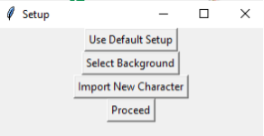

Virtual-Avatar-Streaming-Apperatus (VASA)
================

**University of Pennsylvania**

* Edward Zhang
  * https://www.linkedin.com/in/edwardjczhang/
  * https://zedward23.github.io/personal_Website/
  * https://www.youtube.com/@TheSlepBoi
 
* Tested on: Windows 10 Home, i7-11800H @ 2.3GHz, 16.0GB, NVIDIA GeForce RTX 3060 Laptop GPU


## Features
- Blinking
- Basic Mouth Tracking
- Up to 4 expressions
- Basic Parallax
- Chroma-Key and Stream Compatibility
 
 

## How to Run (Recommended Method)

Open folder in VS Code and pip install the following in a new Terminal:

```
$pip install cv2
$pip install mediapipe
$pip install tkinter
$pip install numpy
$pip install dlib
```
Once the libraries are installed, open `smolAme2.0.py` and run the script. 
A setup window will pop up like the one below:


To quick start, click `Proceed` and a basic streaming window with a Smol Ame avatar with a green screen chroma key background will begin. 

### Backgrounds

You can select a background image using `Select Background` and while arbitrary dimensions are supported, I recommend you ensure the image you choose is a 640x480 32-bit image since the position of the avatar is currently hardcoded.
Using Streamlabs, you can manage otherthings in your scene, so mostly use this background for chroma key stuff.

### Custom Characters

To import a new character besides the default Smol Ame, you can use the `Import Character` button. Due to the slap-dash nature of this project, lots of this is very hard code-y. 

This system supports 4 expressions and blinking for each character, so here are the specs for input images:
- Expressions: 150x150 32-bit
- Face/Body: 200x200 32-bit

To properly map each of the facial expressions to their keybinds, we also need to have a `setup.txt` file that maps the alphabetically listed namings of your character assets to the following mapping:
```
- 0 -> Head/Body
- 1 -> Blink
- 2 -> Expression1
- 3 -> Expression2
- 4 -> Expression3
- 5 -> Expression4
```

Refer to the `smolAme`folder and `Ame_Setup.txt` for reference.

Press esc to quit the program.

## Streaming

I recommend using [StreamLabs](https://streamlabs.com/) as your YouTube/Twitch Encoder for streaming. Please refer to the following resources to get that set up for streaming:
- https://github.com/stream-labs/desktop
- https://www.youtube.com/watch?v=1H6raBbl0QA&ab_channel=KikyoB.University

## Description
Like many people during the COVID-19 lockdowns of 2020 and 2021, I fell down the VTuber rabbit hole and have yet to climb out. Partially I fell in because funny shork go "A", but I was also just personally interested in the tech stack underlying the medium as well as the business implications behind the phenomenon.

This project seeks to act as a free, foundational foray into the task of implementing the entire stack "from scratch" (but with lots of out of box Python packages). I welcome further suggestions and critiques; hopefully I can continue to develop this project to incorporate more of the Live2D aspect of the medium some time in the future.


