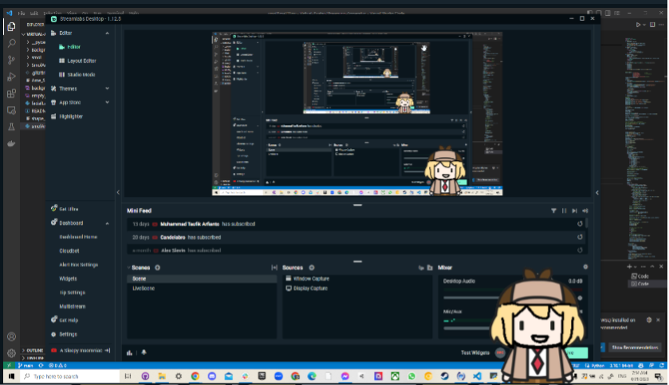

Virtual-Avatar-Streaming-Apperatus (VASA)
================

**University of Pennsylvania**

* Edward Zhang
  * https://www.linkedin.com/in/edwardjczhang/
  * https://zedward23.github.io/personal_Website/
  * https://www.youtube.com/@TheSlepBoi
 
* Tested on: Windows 10 Home, i7-11800H @ 2.3GHz, 16.0GB, NVIDIA GeForce RTX 3060 Laptop GPU

## Description
Like many people during the COVID-19 lockdowns of 2020 and 2021, I fell down the VTuber rabbit hole and have yet to climb out. Partially I fell in because funny shork go "A", but I was also just personally interested in the tech stack underlying the medium as well as the business implications behind the phenomenon.

This project seeks to act as a free, foundational foray into the task of implementing the entire stack "from scratch" (but with lots of out of box Python packages). I welcome further suggestions and critiques; hopefully I can continue to develop this project to incorporate more of the Live2D aspect of the medium some time in the future.

